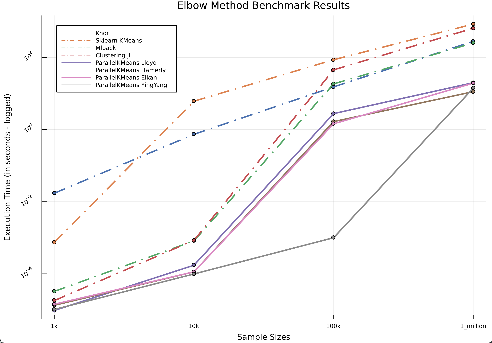

# [ParallelKMeans.jl Package](https://github.com/PyDataBlog/ParallelKMeans.jl)

## Motivation

It's actually a funny story led to the development of this package.
What started off as a personal toy project trying to re-construct the K-Means algorithm in native Julia blew up after a heated discussion on the Julia Discourse forum when I asked for Julia optimization tips. Long story short, Julia community is an amazing one! Andrey offered his help and together, we decided to push the speed limits of Julia with a parallel implementation of the most famous clustering algorithm. The initial results were mind blowing so we have decided to tidy up the implementation and share with the world as a maintained Julia pacakge.

Say hello to `ParallelKMeans`!

This package aims to utilize the speed of Julia and parallelization (both CPU & GPU) to offer an extremely fast implementation of the K-Means clustering algorithm and its variants via a friendly interface for practioners.

In short, we hope this package will eventually mature as the "one-stop-shop" for everything K-Means on CPUs and GPUs.

## K-Means Algorithm Implementation Notes

Since Julia is a column major language, the input (design matrix) expected by the package must be in the following format;

- Design matrix X of size n×m, the i-th column of X `(X[:, i])` is a single data point in n-dimensional space.
- Thus, the rows of the design matrix represent the feature space with the columns representing all the training samples in this feature space.

One of the pitfalls of K-Means algorithm is that it can fall into a local minima.
This implementation inherits this problem like every implementation does.
As a result, it is useful in practice to restart it several times to get the correct results.

## Installation

If you are using  Julia in the recommended [Juno IDE](https://junolab.org/), the number of threads is already set to the number of available CPU cores so multithreading enabled out of the box.
For other IDEs, multithreading must be exported in your environment before launching the Julia REPL in the command line.

*TIP*: One needs to navigate or point to the Julia executable file to be able to launch it in the command line.
Enable multi threading on Mac/Linux systems via;

```bash
export JULIA_NUM_THREADS=n  # where n is the number of threads/cores
```

For Windows systems:

```bash
set JULIA_NUM_THREADS=n  # where n is the number of threads/cores
```

You can grab the latest stable version of this package from Julia registries by simply running;

*NB:* Don't forget to invoke Julia's package manager with `]`

```julia
pkg> add ParallelKMeans
```

The few (and selected) brave ones can simply grab the current experimental features by simply adding the master branch to your development environment after invoking the package manager with `]`:

```julia
pkg> add ParallelKMeans#master
```

You are good to go with bleeding edge features and breakages!

To revert to a stable version, you can simply run:

```julia
pkg> free ParallelKMeans
```

## Features

- Lightning fast implementation of Kmeans clustering algorithm even on a single thread in native Julia.
- Support for multi-threading implementation of K-Means clustering algorithm.
- 'Kmeans++' initialization for faster and better convergence.
- Implementation of available classic and contemporary variants of the K-Means algorithm.

## Pending Features

- [X] Implementation of [Hamerly implementation](https://www.researchgate.net/publication/220906984_Making_k-means_Even_Faster).
- [X] Interface for inclusion in Alan Turing Institute's [MLJModels](https://github.com/alan-turing-institute/MLJModels.jl#who-is-this-repo-for).
- [X] Full Implementation of Triangle inequality based on [Elkan - 2003 Using the Triangle Inequality to Accelerate K-Means"](https://www.aaai.org/Papers/ICML/2003/ICML03-022.pdf).
- [X] Implementation of [Yinyang K-Means: A Drop-In Replacement of the Classic K-Means with Consistent Speedup](https://www.microsoft.com/en-us/research/wp-content/uploads/2016/02/ding15.pdf).
- [X] Implementation of [Coresets](http://proceedings.mlr.press/v51/lucic16-supp.pdf).
- [X] Support for weighted K-means.
- [X] Support of MLJ Random generation hyperparameter.
- [X] Implementation of [Mini-batch KMeans variant](https://www.eecs.tufts.edu/~dsculley/papers/fastkmeans.pdf)
- [X] Add contribution guidelines.
- [ ] Support for other distance metrics supported by [Distances.jl](https://github.com/JuliaStats/Distances.jl#supported-distances).
- [ ] Implementation of [Geometric methods to accelerate k-means algorithm](http://cs.baylor.edu/~hamerly/papers/sdm2016_rysavy_hamerly.pdf).
- [ ] Native support for tabular data inputs outside of MLJModels' interface.
- [ ] Distributed calculations support.
- [ ] Further optimization of code base.
- [ ] Improved Documentation with more tutorials.
- [ ] More benchmark tests.
- [ ] GPU support?

## How To Use

Taking advantage of Julia's brilliant multiple dispatch system, the package exposes users to a very easy-to-use API.

```julia
using ParallelKMeans

# Uses all available CPU cores by default
multi_results = kmeans(X, 3; max_iters=300)

# Use only 1 core of CPU
results = kmeans(X, 3; n_threads=1, max_iters=300)
```

The main design goal is to offer all available variations of the KMeans algorithm to end users as composable elements. By default, Lloyd's implementation is used but users can specify different variations of the KMeans clustering algorithm via this interface;

```julia
some_results = kmeans([algo], input_matrix, k; kwargs)

# example
r = kmeans(Lloyd(), X, 3)  # same result as the default
```

```julia
# r contains all the learned artifacts that can be accessed as;
r.centers               # cluster centers (d x k)
r.assignments           # label assignments (n)
r.totalcost             # total cost (i.e. objective)
r.iterations            # number of elapsed iterations
r.converged             # whether the procedure converged
```

### Supported KMeans algorithm variations and recommended use cases

- [Lloyd()](https://cs.nyu.edu/~roweis/csc2515-2006/readings/lloyd57.pdf)  - Default algorithm but only recommended for very small matrices (switch to `n_threads = 1` to avoid overhead).
- [Hamerly()](https://www.researchgate.net/publication/220906984_Making_k-means_Even_Faster) - Hamerly is good for moderate number of clusters (< 50?) and moderate dimensions (<100?).
- [Elkan()](https://www.aaai.org/Papers/ICML/2003/ICML03-022.pdf) - Recommended for high dimensional data.
- [Yinyang()](https://www.microsoft.com/en-us/research/wp-content/uploads/2016/02/ding15.pdf) - Recommended for large dimensions and/or large number of clusters.
- [Coreset()](http://proceedings.mlr.press/v51/lucic16-supp.pdf) - Recommended for very fast clustering of very large datasets, when extreme accuracy is not important.
- [MiniBatch()](https://www.eecs.tufts.edu/~dsculley/papers/fastkmeans.pdf) - Recommended for extremely large datasets, when extreme accuracy is not important. *Experimental Implementation*
- [Geometric()](http://cs.baylor.edu/~hamerly/papers/sdm2016_rysavy_hamerly.pdf) - (Coming soon)

### Practical Usage Examples

Some of the common usage examples of this package are as follows:

#### Clustering With A Desired Number Of Groups

```julia
using ParallelKMeans, RDatasets, Plots

# load the data
iris = dataset("datasets", "iris");

# features to use for clustering
features = collect(Matrix(iris[:, 1:4])');

# various artifacts can be accessed from the result i.e. assigned labels, cost value etc
result = kmeans(features, 3);

# plot with the point color mapped to the assigned cluster index
scatter(iris.PetalLength, iris.PetalWidth, marker_z=result.assignments,
        color=:lightrainbow, legend=false)

```


#### Elbow Method For The Selection Of optimal number of clusters

```julia
using ParallelKMeans

# Single Thread Implementation of Lloyd's Algorithm
b = [ParallelKMeans.kmeans(X, i, n_threads=1; tol=1e-6, max_iters=300, verbose=false).totalcost for i = 2:10]

# Multi-threaded Implementation of Lloyd's Algorithm by default
c = [ParallelKMeans.kmeans(X, i; tol=1e-6, max_iters=300, verbose=false).totalcost for i = 2:10]

```

## Benchmarks

Currently, this package is benchmarked against similar implementations in both Python and Julia. All reproducible benchmarks can be found in [ParallelKMeans/extras](https://github.com/PyDataBlog/ParallelKMeans.jl/tree/master/extras) directory. More tests in various languages are planned beyond the initial release version (`0.1.0`).

*Note*: All benchmark tests are made on the same computer to help eliminate any bias.

|PC Name                      |CPU                       |Ram                |
|:---------------------------:|:------------------------:|:-----------------:|
|iMac (Retina 5K 27-inch 2019)|3 GHz 6-Core Intel Core i5|24 GB 2667 MHz DDR4|

Currently, the benchmark speed tests are based on the search for optimal number of clusters using the [Elbow Method](https://en.wikipedia.org/wiki/Elbow_method_(clustering)) since this is a practical use case for most practioners employing the K-Means algorithm.

### Benchmark Results



_________________________________________________________________________________________________________

|1 million sample (secs)|100k sample (secs)|10k sample (secs)|1k sample (secs)|package                 |language   |process   |
|-----------------------|------------------|-----------------|----------------|------------------------|-----------|----------|
|282.7                  |15.27             |0.7324           |0.01682         |Knor                    |R          |full scan |
|854                    |87                |6.11             |0.000719        |Sklearn KMeans          |Python     |full scan |
|11.2                   |1.41              |0.000317         |0.000141        |Sklearn MiniBatch Kmeans|Python     |stochastic|
|254.481                |18.517            |0.000794956      |0.000031211     |Mlpack                  |C++ Wrapper|full scan |
|653.178                |45.468            |0.000824115      |0.000017301     |Clustering.jl           |Julia      |full scan |
|19.955                 |2.758             |0.000166957      |0.000009206     |ParallelKMeans Lloyd    |Julia      |full scan |
|11.234                 |1.654             |0.000109074      |0.000012819     |ParallelKMeans Hamerly  |Julia      |full scan |
|19.394                 |1.436             |0.000109262      |0.000013726     |ParallelKMeans Elkan    |Julia      |full scan |
|14.080                 |0.000972914       |0.000095325      |0.000009802     |ParallelKMeans YingYang |Julia      |full scan |

_________________________________________________________________________________________________________

## Release History

- 0.1.0 Initial release.
- 0.1.1 Added interface for MLJ.
- 0.1.2 Added `Elkan` algorithm.
- 0.1.3 Faster & optimized execution.
- 0.1.4 Bug fixes.
- 0.1.5 Added `Yinyang` algorithm.
- 0.1.6 Added support for weighted k-means; Added `Coreset` algorithm; improved support for different types of the design matrix.
- 0.1.7 Added `Yinyang` and `Coreset` support in MLJ interface; added `weights` support in MLJ; added RNG seed support in MLJ interface and through all algorithms; added metric support.
- 0.1.8 Minor cleanup.
- 0.1.9 Added travis support for Julia 1.5.
- 0.2.0 Updated MLJ Interface.
- 0.2.1 Initial Mini-batch implementation.
- 0.2.2 Updated MLJInterface.
- 1.0.0 Stable public release.

## Contributing

Ultimately, we see this package as potentially the one-stop-shop for everything related to KMeans algorithm and its speed up variants. We are open to new implementations and ideas from anyone interested in this project.
This project adopts the [ColPrac community guidelines](https://github.com/SciML/ColPrac).

```@index
```

```@autodocs
Modules = [ParallelKMeans]
```
